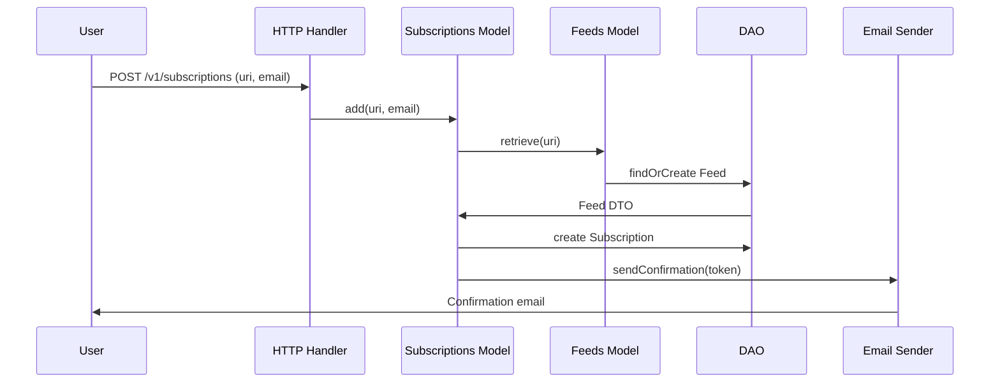

# Subscription Flow

Status: Implemented

## Overview

### Purpose

Allow users to subscribe to an RSS/Atom feed via email with a confirmation workflow (double opt-in).

## Architecture

### Entrypoints

- `public/v1/subscriptions/index.php` — Initial subscription request (GET/POST)
- `public/v1/subscriptions/confirmation/index.php` — Email confirmation link
- `public/v1/subscriptions/cancellation/index.php` — Unsubscribe link

### Data flow

```
Request → validate(uri, email) → retrieve feed → create subscription → send confirmation email
                                                                        ↓
                                                              User clicks link →
                                                          confirm subscription (token)
```

## Workflows

### 1. Subscribe (Happy Path)

1. User submits feed URI + email via form/API.
2. System validates both fields.
3. System fetches the feed (cached <24h).
4. If feed is new → fetch and store; if existing and stale → re-fetch.
5. Create subscription row (unconfirmed) or re-send confirmation if already exists.
6. Send confirmation email with signed token link.
7. Return success response (JSON or HTML).

### 2. Confirm Subscription

1. User clicks link with `?feed_uri=...&email=...&token=...`.
2. System verifies token = `hash(email)`.
3. If valid → set `confirmed=1`.
4. Return success page.

### 3. Cancel Subscription

1. User clicks unsubscribe link with `?feed_uri=...&email=...&token=...`.
2. System verifies token = `hash(email)`.
3. If valid → delete subscription row.
4. Return success page.

### 4. Error Cases

| Condition | Behavior |
|-----------|----------|
| Invalid feed URI | Return 400 with error message |
| Invalid email | Return 400 with error message |
| Unreachable feed URL | Return error, subscription not created |
| Invalid confirmation token | Return error page (token mismatch) |
| Expired/superseded confirmation | Re-request confirmation (idempotent) |
| Missing return URL with redirect flag | Return 400 |

## APIs

### GET/POST /v1/subscriptions/

Query parameters:

| Parameter | Type | Required | Description |
|-----------|------|----------|-------------|
| uri | URL | Yes | Feed URI to subscribe |
| email | Email | Yes | Subscriber email |
| return | URL | No | Redirect target after operation |
| redirect | Boolean | No | Use 302 redirect response instead of HTML/JSON |

### Responses

- `200` — HTML or JSON with success/error message.
- `302` — Redirect to `?return=...` with `result`, `title`, `ok` params.
- `400` — Validation error.

## Security Considerations

- Tokens are HMAC-SHA256 hashes of the email using a server secret.
- Confirmation links are single-purpose (no re-confirmation possible after token change).
- Unsubscribe operations require valid token tied to the email.
- Rate limiting is NOT currently implemented (future consideration).

## Sequence Diagram


